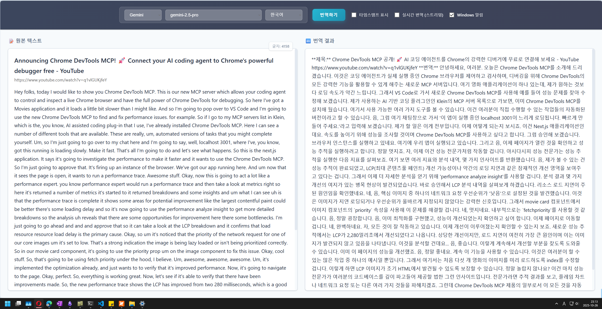

# 🔤 YouTube Translator

[](https://www.python.org/downloads/)
[](https://fastapi.tiangolo.com/)
[](https://developer.chrome.com/docs/extensions/)

YouTube 동영상의 자막을 AI를 활용하여 실시간 번역하는 크롬 확장 프로그램입니다. OpenAI GPT와 Google Gemini 모델을 지원하며, 강력한 백엔드 API를 통해 고품질 번역을 제공합니다.



## ✨ 주요 기능

- 🎬 **YouTube 자막 자동 추출**: 동영상 ID를 통해 자동으로 자막 데이터를 가져옵니다
- 🔄 **실시간 번역**: OpenAI GPT-4/GPT-3.5, Google Gemini 1.5 지원
- 🌐 **다국어 지원**: 10개 이상 언어로 번역 지원
- 🎨 **직관적인 UI**: Chrome 확장에서 바로 번역 결과를 확인
- 📊 **타임스탬프 관리**: 자막의 시간 정보를 유지하며 표시
- 🔄 **스트리밍 번역**: 실시간으로 번역 결과를 받아볼 수 있습니다
- 🔔 **Windows 알림**: 번역 완료 시 시스템 알림 지원

## 🏗️ 시스템 아키텍처

```
┌─────────────────┐    ┌─────────────────┐    ┌─────────────────┐
│   Chrome        │    │     Backend      │    │     AI APIs     │
│  Extension      │◄──►│   (FastAPI)      │◄──►│  OpenAI/Gemini  │
│                 │    │                 │    │                 │
│ • content.js    │    │ • /translate     │    │ • GPT Models    │
│ • background.js │    │ • /get_transcript│    │ • Gemini Models │
│ • translator_ui │    │ • /translate_stream │ │                 │
└─────────────────┘    └─────────────────┘    └─────────────────┘
```

## 📁 프로젝트 구조

```
my-translator-for-youtube/
├── backend/                    # FastAPI 백엔드 서버
│   ├── main.py                # 서버 엔트리 포인트
│   ├── routes.py              # API 엔드포인트 정의
│   ├── services.py            # 핵심 비즈니스 로직
│   ├── models.py              # Pydantic 모델
│   ├── validators.py          # 환경변수 검증
│   └── notification_service.py # Windows 알림 서비스
├── chrome_extension/          # Chrome 확장 프로그램
│   ├── manifest.json          # 확장 메타데이터
│   ├── background.js          # 백그라운드 서비스 워커
│   ├── content.js             # YouTube 페이지 주입 스크립트
│   ├── translator_ui.html     # 번역 UI 인터페이스
│   ├── translator_ui.js       # UI 로직
│   └── icon.svg               # 확장 아이콘
├── start_server.ps1         # 서버 시작 스크립트
├── stop_server.ps1          # 서버 중지 스크립트
└── README.md
```

## 🛠️ 기술 스택

### Backend
- **Python 3.9+**
- **FastAPI**: 고성능 REST API 프레임워크
- **Uvicorn**: ASGI 서버
- **OpenAI SDK**: GPT 모델 연동
- **Google Generative AI**: Gemini 모델 연동
- **youtube_transcript_api**: YouTube 동영상 자막 추출 라이브러리

### Frontend
- **JavaScript (ES6+)**
- **Chrome Extensions API**: Manifest V3
- **HTML5/CSS3**: 모던 웹 표준

### DevOps
- **uv**: Python 패키지 관리 도구
- **python-dotenv**: 환경변수 관리
- **plyer**: 크로스 플랫폼 알림

## 🚀 빠른 시작

### 사전 요구사항

- Python 3.9 이상
- Google Chrome 브라우저
- OpenAI 또는 Google Gemini API 키

### 1. 저장소 클론 및 환경설정

```bash
git clone <repository-url>
cd my-translator-for-youtube
```

### 2. 가상환경 생성 및 패키지 설치

```powershell
# uv를 사용하여 가상환경 생성
uv venv .venv

# 가상환경 활성화
.venv\Scripts\activate

# 의존성 패키지 설치
cd backend
uv pip install -e .
```

### 3. 환경변수 설정

```powershell
# 환경변수 템플릿 복사
cp .env.example .env
```

**`.env` 파일 수정:**
```env
# Google Gemini API (선택사항)
GEMINI_API_KEY=your_gemini_api_key_here

# OpenAI API (선택사항)
OPENAI_API_KEY=your_openai_api_key_here
```

**API 키 발급:**
- **Google Gemini**: [Google AI Studio](https://aistudio.google.com/app/apikey)
- **OpenAI**: [OpenAI Platform](https://platform.openai.com/api-keys)

### 4. 서버 실행

```powershell
# 루트 디렉토리로 이동
cd ..

# 서버 실행 스크립트
.\start_server.ps1
```

성공적으로 실행되면 `http://localhost:5000`에서 API 서버가 시작됩니다.

## 📖 사용법

### Chrome 확장 프로그램 설치

1. Chrome 브라우저에서 `chrome://extensions` 방문
2. 우측 상단 **"개발자 모드"** 활성화
3. **"압축해제된 확장 프로그램을 로드합니다"** 클릭
4. `chrome_extension` 폴더 선택

### YouTube 동영상 번역

1. YouTube 동영상 페이지로 이동
2. 영상 플레이어 우측 하단의 전구 아이콘 클릭
3. 자동으로 자막 추출 및 번역 UI 표시
4. 원하는 모델과 대상 언어 선택(Gemini, ChatGPT 등 각각 다양한 모델 중, 일부 모델은 번역이 안될 수가 있음)
5. **"번역하기"** 버튼 클릭

### 고급 옵션

- **타임스탬프 표시**: 자막의 시간 정보 유지
- **실시간 번역**: 스트리밍 옵션으로 실시간 번역 결과 확인
- **Windows 알림**: 번역 완료 시 데스크톱 알림 수신

## 🔧 API 엔드포인트

### GET `/models`
사용 가능한 AI 모델 목록 조회

**Parameters:**
- `provider` (string): 모델 제공자 (`gemini`, `openai`)

**응답 예시:**
```json
[
  "gemini-1.5-flash",
  "gemini-1.5-pro",
  "gpt-4",
  "gpt-3.5-turbo"
]
```

### POST `/translate`
텍스트 번역

**요청 본문:**
```json
{
  "text": "Hello, how are you today?",
  "model": "gemini-1.5-flash",
  "target_language": "ko",
  "show_notification": true
}
```

**응답 예시:**
```json
{
  "translated_text": "안녕하세요, 오늘 어떻게 지내세요?",
  "model_used": "gemini-1.5-flash",
  "language": "ko"
}
```

### GET `/get_transcript`
YouTube 동영상 자막 추출

**Parameters:**
- `video_id` (string): YouTube 동영상 ID
- `preserve_timestamps` (boolean): 타임스탬프 정보 유지 여부

### POST `/translate_stream`
스트리밍 번역 (실시간 응답)

**요청 본문:** `/translate`와 동일


## 🐛 문제 해결

### 서버가 시작되지 않는 경우
- `.env` 파일에 API 키가 올바르게 설정되었는지 확인
- 가상환경이 활성화되었는지 확인
- `uv.lock` 파일을 제거하고 재설치 시도

### Chrome 확장 프로그램이 동작하지 않는 경우
- `chrome://extensions`에서 확장 프로그램 새로고침
- 백엔드 서버가 `http://localhost:5000`에서 실행 중인지 확인
- Chrome 개발자 도구에서 콘솔 에러 확인

### 번역 실패 시
- API 키 유효성 및 잔액 확인
- 인터넷 연결 상태 점검
- 빈 텍스트나 특수문자 입력 시도

## 🤝 기여하기

1. Fork 프로젝트
2. 새로운 브랜치 생성: `git checkout -b feature/amazing-feature`
3. 변경사항 커밋: `git commit -m 'Add amazing feature'`
4. 브랜치 푸시: `git push origin feature/amazing-feature`
5. Pull Request 생성


---

**문의사항이 있으시면 GitHub Issues를 통해 알려주세요! 🚀**
