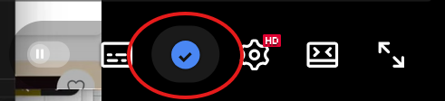
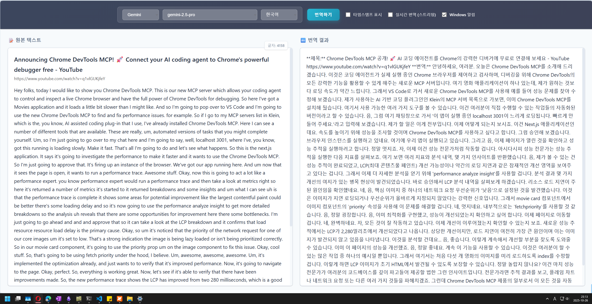

# 🔤 YouTube Translator

[](https://www.python.org/downloads/)
[](https://fastapi.tiangolo.com/)
[](https://developer.chrome.com/docs/extensions/)
[](https://developer.mozilla.org/en-US/docs/Mozilla/Add-ons/WebExtensions)

YouTube 동영상의 자막을 AI로 풀번역/요약하는 브라우저 확장 프로그램(Chrome & Firefox)입니다. OpenAI GPT와 Google Gemini를 지원하며, 세그먼트 태깅·스크롤 동기화·네트워크/할당량 진단까지 포함해 로컬에서 안정적으로 사용할 수 있습니다.




> [!IMPORTANT]
> **🚨 크롬 확장 프로그램 단독 자막 추출 불가 안내**
> 최근 YouTube의 보안 정책 강화(Service Worker 및 Dry Fetch 차단)로 인해, 브라우저 확장 프로그램 환경(`fetch`, `XHR`)에서 자막 데이터(`timedtext`)를 직접 요청할 경우 **의도적으로 비어있는 응답(Empty Response)**을 반환하도록 처리되고 있습니다.
>
> 따라서 **프론트엔드(확장 프로그램) 단독으로는 자막을 가져올 수 없으며**, 자막 추출을 백엔드에서 수행해야 합니다.

## ✨ 주요 기능

- 🎬 **YouTube 자막 자동 추출**: 동영상 ID를 통해 자동으로 자막 데이터를 가져옵니다
- 🔄 **실시간 번역**: OpenAI, Google Gemini 계열 지원
- 🌐 **다국어 지원**: 10개 이상 언어로 번역 지원
- 🎨 **직관적인 UI**: Chrome 및 Firefox 확장에서 바로 번역 결과를 확인
- 📊 **타임스탬프 관리**: 자막의 시간 정보를 유지하며 표시
- 🧭 **스크롤 동기화**: 입력/출력 세그먼트 매핑으로 양쪽 창 스크롤 동기화
- 🪄 **세그먼트 태깅**: [SEG-XXXX] 태그 기반 문단 정렬로 커서/하이라이트 매칭
- 🩺 **진단 메시지**: 네트워크 오류 원인 힌트+백엔드 /health 체크, LLM 오류 원문 노출
- 🔔 **Windows 알림**: 번역 완료 시 시스템 알림 지원

## 🏗️ 시스템 아키텍처

```
┌─────────────────┐    ┌─────────────────────┐    ┌─────────────────┐
│ Browser Ext     │    │     Backend         │    │     AI APIs     │
│ (Chrome/Firefox)│◄──►│   (FastAPI)         │◄──►│  OpenAI/Gemini  │
│                 │    │                     │    │                 │
│ • content.js    │    │ • /translate        │    │ • GPT Models    │
│ • background.js │    │ • /get_transcript   │    │ • Gemini Models │
│ • translator_ui │    │ • /translate_stream │    │                 │
└─────────────────┘    └─────────────────────┘    └─────────────────┘
```

## 📁 프로젝트 구조

```
translator_for_youtube/
├── backend/                          # FastAPI 백엔드 서버
│   ├── main.py                       # 서버 엔트리 포인트
│   ├── routes.py                     # API 엔드포인트 정의
│   ├── services.py                   # 핵심 비즈니스 로직
│   ├── models.py                     # Pydantic 모델
│   ├── validators.py                 # 환경변수 검증
│   ├── notification_service.py       # Windows 알림 서비스
│   ├── exceptions.py                 # 예외 처리
│   ├── config.json                   # 설정 파일
│   ├── .env.example                  # 환경변수 템플릿
│   ├── pyproject.toml                # 프로젝트 설정
│   ├── requirements.txt              # 의존성
│   ├── uv.lock                       # uv 잠금 파일
│   ├── server.ps1                    # PowerShell 서버 스크립트
│   ├── register_startup.ps1          # 시작 프로그램 등록
│   ├── start_server.bat              # 서버 시작 배치 파일
│   ├── stop_server.bat               # 서버 중지 배치 파일
│   ├── app.pid                       # 서버 PID 파일
│   ├── tests/                        # 테스트 파일들
│   ├── __init__.py                   # 패키지 초기화
│   ├── translation_server.log        # 로그 파일
│
├── frontend/chrome_extension/        # Chrome 확장 프로그램 (MV3)
│   ├── ...
├── frontend/firefox_extension/       # Firefox 확장 프로그램 (MV3)
│   ├── manifest.json                 # Firefox 전용 메타데이터
│   ├── background.js                 # 백그라운드 스크립트 (Cross-browser)
│   ├── content.js                    # YouTube 페이지 주입 스크립트
│   └── ...                           # 기타 공유 리소스 (UI, Icons)
├── package.json                      # Node.js 패키지 설정
├── package-lock.json                 # NPM 잠금 파일
├── biome.json                        # 코드 포매터 설정
├── .gitignore                        # Git 무시 파일
├── image.png                         # 이미지 파일
├── image-2.png                       # 두 번째 이미지 파일
├── README.md                         # 프로젝트 문서
```

## 🛠️ 기술 스택

### Backend
- **Python 3.9+**
- **FastAPI**: 고성능 REST API 프레임워크
- **Uvicorn**: ASGI 서버
- **OpenAI SDK**: GPT 모델 연동
- **Google Gen AI SDK**: 최신 Gemini 모델 연동 (v1.0+)
- **youtube_transcript_api**: YouTube 동영상 자막 추출 라이브러리

### Frontend
- **JavaScript (ES6+)**
- **Chrome Extensions API**: Manifest V3
- **WebExtensions API (Firefox)**: cross-browser compatibility 지원
- **HTML5/CSS3**: 모던 웹 표준

### DevOps
- **uv**: Python 패키지 관리 도구
- **python-dotenv**: 환경변수 관리
- **plyer**: 크로스 플랫폼 알림

## 🚀 빠른 시작

### 사전 요구사항

- Python 3.9 이상
- Google Chrome 브라우저
- OpenAI 또는 Google Gemini API 키

### 1. 저장소 클론 및 환경설정

```bash
git clone https://github.com/koolsg/translator_for_youtube.git
cd translator_for_youtube
```

### 2. 가상환경 생성 및 패키지 설치

```powershell
# uv를 사용하여 가상환경 생성
uv venv .venv

# 가상환경 활성화
.venv\Scripts\activate

# 의존성 패키지 설치
cd backend
uv pip install -e .
```

### 3. 환경변수 설정

```powershell
# 환경변수 템플릿 복사
cp .env.example .env
```

**`.env` 파일 수정:**
```env
# Google Gemini API (선택사항)
GEMINI_API_KEY=your_gemini_api_key_here

# OpenAI API (선택사항)
OPENAI_API_KEY=your_openai_api_key_here
```

**API 키 발급:**
- **Google Gemini**: https://aistudio.google.com/app/apikey
- **OpenAI**: https://platform.openai.com/api-keys

### 4. 서버 실행

```powershell
# 서버 실행 스크립트
.\backend\start_server.bat
```

성공적으로 실행되면 `http://localhost:5000`에서 API 서버가 시작됩니다. 프런트 확장 프로그램은 이 주소로 통신합니다.

## 📖 사용법

### Chrome 확장 프로그램 설치

1. Chrome 브라우저에서 `chrome://extensions` 방문
2. 우측 상단 **"개발자 모드"** 활성화
3. **"압축해제된 확장 프로그램을 로드합니다"** 클릭
4. `frontend\chrome_extension` 폴더 선택

### Firefox 확장 프로그램 설치

1. Firefox 주소창에서 `about:debugging#/runtime/this-firefox` 방문
2. **"임시 부가 기능 로드(Load Temporary Add-on...)"** 클릭
3. `frontend\firefox_extension\manifest.json` 파일 선택

### YouTube 동영상 번역

1. YouTube 동영상 페이지로 이동
2. 영상 플레이어 우측 하단의 전구 아이콘 클릭
3. 자동으로 자막 추출 및 번역 UI 표시
4. 원하는 모델과 대상 언어 선택(Gemini, GPT 등)
5. **"번역하기"** 버튼 클릭

### 고급 옵션

- **타임스탬프 표시**: 자막의 시간 정보 유지
- **실시간 번역**: 스트리밍 옵션으로 실시간 번역 결과 확인
- **스크롤 동기화**: 입력/출력 세그먼트 하이라이트·동시 스크롤
- **Windows 알림**: 번역 완료 시 데스크톱 알림 수신

## 🔧 API 엔드포인트

### GET `/models`
사용 가능한 AI 모델 목록 조회

**Parameters:**
- `provider` (string): 모델 제공자 (`gemini`, `openai`)

**응답 예시:**
```json
[
  "gemini-1.5-flash",
  "gemini-1.5-pro",
  "gpt-4",
  "gpt-3.5-turbo"
]
```

### POST `/translate`
텍스트 번역

**요청 본문:**
```json
{
  "text": "Hello, how are you today?",
  "model": "gemini-1.5-flash",
  "target_language": "ko",
  "show_notification": true
}
```

**응답 예시:**
```json
{
  "translated_text": "안녕하세요, 오늘 어떻게 지내세요?",
  "model_used": "gemini-1.5-flash",
  "language": "ko"
}
```

### GET `/get_transcript`
YouTube 동영상 자막 추출

**Parameters:**
- `video_id` (string): YouTube 동영상 ID
- `preserve_timestamps` (boolean): 타임스탬프 정보 유지 여부

### POST `/translate_stream`
스트리밍 번역 (실시간 응답)

**요청 본문:** `/translate`와 동일

## 🐛 문제 해결

### 서버가 시작되지 않는 경우
- `.env` 파일에 API 키가 올바르게 설정되었는지 확인
- 가상환경이 활성화되었는지 확인
- `uv.lock` 파일을 제거하고 재설치 시도
- `GET http://localhost:5000/health` 로 헬스 체크

### Chrome 확장 프로그램이 동작하지 않는 경우
- `chrome://extensions`에서 확장 프로그램 새로고침
- 백엔드 서버가 `http://localhost:5000`에서 실행 중인지 확인
- Chrome 개발자 도구에서 콘솔 에러 확인

### 번역 실패 시
- 네트워크 오류 메시지의 원인 힌트 확인(서버 미기동, DNS, 프록시/Adblock 차단 등)
- API 키 유효성 및 잔액 확인
- 인터넷 연결 상태 점검
- 빈 텍스트나 특수문자 입력 시도

## 개발 지원
본 프로그램은 gemini 2.5 pro, gpt5, gpt5.1 codex max, grok code fast-1 등의 도움을 받아 개발되었습니다.


---

**문의사항이 있으시면 GitHub Issues를 통해 알려주세요! 🚀**
